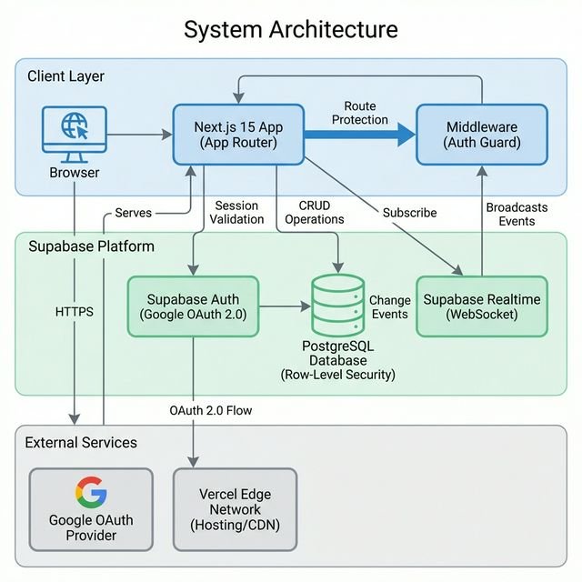
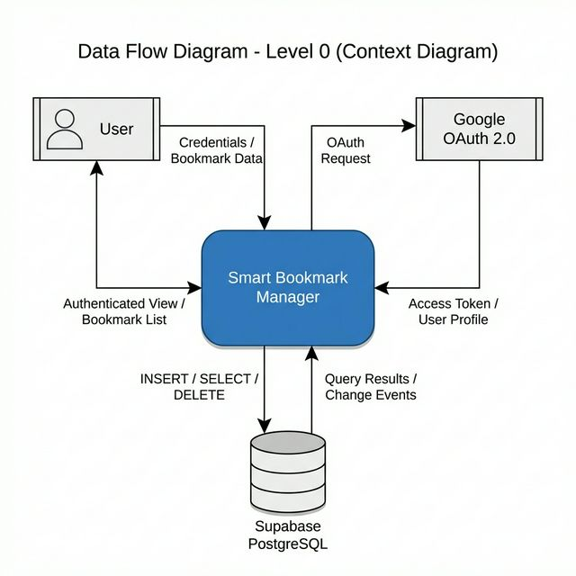
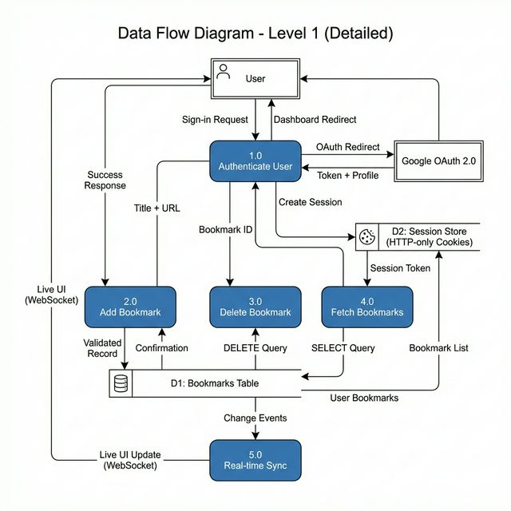
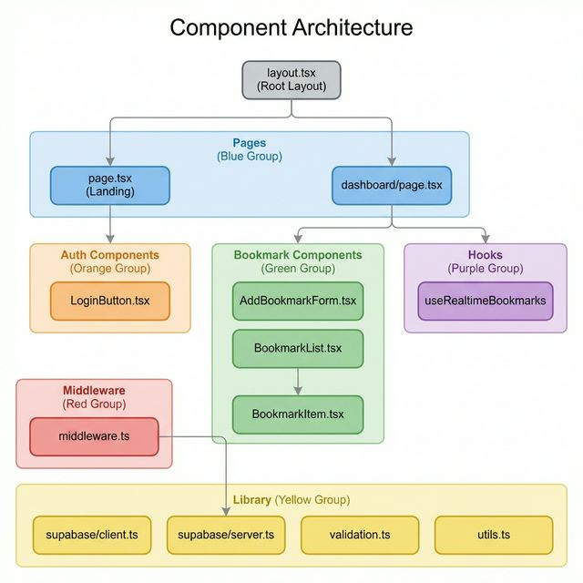
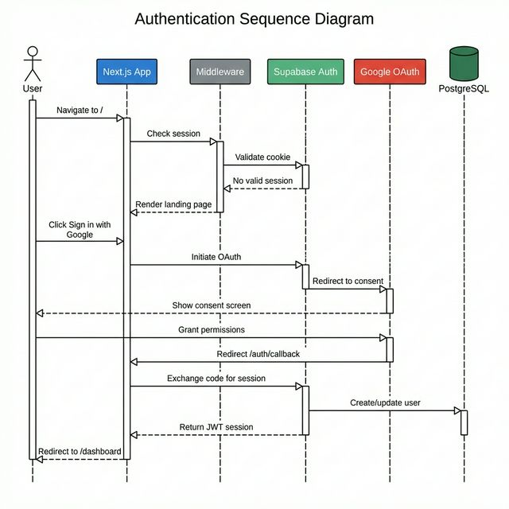

# Smart Bookmark Manager


## Table of Contents

- [Introduction](#introduction)
- [Architecture Overview](#architecture-overview)
  - [System Architecture](#system-architecture)
  - [Data Flow Diagram (DFD) -- Level 0](#data-flow-diagram-dfd----level-0)
  - [Data Flow Diagram (DFD) -- Level 1](#data-flow-diagram-dfd----level-1)
  - [Component Architecture](#component-architecture)
  - [Authentication Sequence](#authentication-sequence)
- [Features](#features)
- [Technology Stack](#technology-stack)
- [Database Schema](#database-schema)
- [Project Structure](#project-structure)
- [Getting Started](#getting-started)
  - [Prerequisites](#prerequisites)
  - [Installation](#installation)
  - [Database Setup](#database-setup)
  - [Running the Application](#running-the-application)
- [Security Model](#security-model)
- [Real-time Synchronization](#real-time-synchronization)
- [Challenges and Solutions](#challenges-and-solutions)
- [Contributing](#contributing)
- [License](#license)

---

## Introduction

Smart Bookmark Manager is a modern, full-stack web application that enables users to organize and manage their bookmarks with real-time synchronization across all browser sessions. Built on Next.js 15 (App Router), Supabase (PostgreSQL), and TypeScript, the application provides a secure, performant, and responsive experience with enterprise-grade data isolation through Row-Level Security (RLS).

The application addresses the common problem of fragmented bookmark management by offering instant cross-tab synchronization via WebSocket connections, eliminating the need for manual page refreshes. Authentication is handled exclusively through Google OAuth 2.0, ensuring a secure and frictionless onboarding experience.

---

## Architecture Overview

### System Architecture

The following diagram illustrates the high-level system architecture, showing how the client application communicates with external services.



**Architectural Pattern:** Monolithic full-stack application following the JAMstack paradigm (JavaScript, APIs, Markup), deployed as a serverless application on Vercel Edge Functions.

**Key Design Decisions:**
- Server-side rendering (SSR) via Next.js App Router for improved performance and SEO.
- Backend-as-a-Service (BaaS) model with Supabase to eliminate the need for a custom backend.
- Middleware-level authentication enforcement to protect routes before rendering.

---

### Data Flow Diagram (DFD) -- Level 0

The Level 0 context diagram shows the system boundary and external entities that interact with Smart Bookmark Manager.



| Data Store | Technology | Purpose |
|---|---|---|
| Bookmarks Table | Supabase PostgreSQL | Persistent storage for all bookmark records |
| Session Store | HTTP-only Cookies | Secure storage of JWT authentication tokens |

| External Entity | Role |
|---|---|
| User | Interacts with the application through a web browser |
| Google OAuth 2.0 | External identity provider for authentication |

---

### Data Flow Diagram (DFD) -- Level 1

The Level 1 diagram decomposes the system into its core processes, showing detailed data flows between each process, data store, and external entity.



**Processes:**
| Process | Description |
|---|---|
| 1.0 Authenticate User | Handles Google OAuth flow, session creation, and user identity management |
| 2.0 Add Bookmark | Validates and persists new bookmark records to the database |
| 3.0 Delete Bookmark | Removes bookmark records from the database by ID |
| 4.0 Fetch Bookmarks | Retrieves the authenticated user's bookmarks from the database |
| 5.0 Real-time Sync | Broadcasts database change events to connected clients via WebSocket |

---

### Component Architecture

The following diagram shows the React component hierarchy and the dependency relationships between pages, components, hooks, and the library layer.



**Component Groups:**
| Group | Components | Responsibility |
|---|---|---|
| Pages | `page.tsx`, `dashboard/page.tsx` | Route-level server components that compose the UI |
| Auth Components | `LoginButton.tsx` | Google OAuth sign-in button (client component) |
| Bookmark Components | `AddBookmarkForm.tsx`, `BookmarkList.tsx`, `BookmarkItem.tsx` | CRUD operations for bookmark management |
| Hooks | `useRealtimeBookmarks` | WebSocket subscription for real-time data sync |
| Library | `supabase/client.ts`, `supabase/server.ts`, `validation.ts` | Shared utilities and Supabase client instances |
| Middleware | `middleware.ts` | Route protection via session validation |

---

### Authentication Sequence

The following sequence diagram details the Google OAuth authentication flow, from initial page load through session establishment and dashboard access.



**Flow Summary:**
1. User navigates to the landing page. Middleware validates the session cookie and renders the public landing page if no valid session exists.
2. User clicks "Sign in with Google", which triggers the Supabase OAuth flow. The user is redirected to Googles consent screen.
3. Upon granting permissions, Google redirects to `/auth/callback` with an authorization code.
4. The application exchanges the code for a JWT session, stores it in an HTTP-only cookie, and redirects the user to the authenticated dashboard.
5. Subsequent requests to protected routes are validated by the middleware before rendering.

---

## Features

- **Secure Authentication** -- User authentication via Google OAuth 2.0, powered by Supabase Auth. Session tokens are stored in HTTP-only cookies to prevent XSS attacks.
- **Real-time Synchronization** -- Bookmark operations (create, delete) are propagated instantly to all open browser tabs via Supabase Realtime WebSocket subscriptions, eliminating the need for manual refreshes.
- **Row-Level Security (RLS)** -- Enterprise-grade data isolation enforced at the database level. Each user can only read, insert, update, and delete their own bookmark records, regardless of client-side logic.
- **Responsive Design** -- Mobile-first interface built with Tailwind CSS, ensuring a consistent experience across desktop, tablet, and mobile viewports.
- **Type Safety** -- Full TypeScript coverage across the entire codebase, providing compile-time error detection, improved IDE support, and long-term maintainability.
- **Input Validation** -- Client-side and server-side validation using Zod schemas to enforce URL format correctness, title length constraints, and data integrity before database writes.

---

## Technology Stack

| Layer | Technology | Version | Purpose |
|---|---|---|---|
| Framework | Next.js (App Router) | 15.x | Server-side rendering, file-based routing, API routes |
| Language | TypeScript | 5.x | Static type safety and developer tooling |
| UI Library | React | 19.x | Component-based UI architecture |
| Styling | Tailwind CSS | 4.x | Utility-first CSS framework |
| Database | PostgreSQL (Supabase) | 15.x | ACID-compliant relational data store |
| Authentication | Supabase Auth | -- | Google OAuth 2.0 provider integration |
| Real-time | Supabase Realtime | -- | WebSocket-based change data capture |
| Validation | Zod | 4.x | Schema-based runtime validation |
| Icons | Lucide React | -- | Lightweight SVG icon library |
| Hosting | Vercel | -- | Edge network, serverless deployment |

---

## Database Schema

The application uses a single `bookmarks` table with Row-Level Security policies, linked to the Supabase-managed `auth.users` table.

**Table: `bookmarks`**

| Column | Type | Constraints |
|---|---|---|
| `id` | `UUID` | Primary Key, auto-generated via `gen_random_uuid()` |
| `user_id` | `UUID` | Foreign Key to `auth.users(id)`, `ON DELETE CASCADE`, `NOT NULL` |
| `title` | `TEXT` | `NOT NULL`, length between 1 and 200 characters |
| `url` | `TEXT` | `NOT NULL`, non-empty |
| `created_at` | `TIMESTAMPTZ` | Default: `NOW()` |
| `updated_at` | `TIMESTAMPTZ` | Default: `NOW()`, auto-updated via database trigger |

**Indexes:**
- `bookmarks_user_id_idx` on `user_id` -- optimizes user-scoped queries.
- `bookmarks_created_at_idx` on `created_at DESC` -- optimizes chronological listing.

**RLS Policies:**
- `SELECT` -- Users can only read bookmarks where `user_id` matches their authenticated ID.
- `INSERT` -- Users can only create bookmarks with their own `user_id`.
- `UPDATE` -- Users can only modify their own bookmarks.
- `DELETE` -- Users can only remove their own bookmarks.

---

## Project Structure

```
smart-bookmark-app/
├── docs/
│   └── diagrams/                    # Architecture and DFD diagram images
├── public/                          # Static assets
├── src/
│   ├── app/
│   │   ├── auth/
│   │   │   ├── callback/route.ts    # OAuth callback handler
│   │   │   └── signout/route.ts     # Sign-out route handler
│   │   ├── dashboard/page.tsx       # Main dashboard (authenticated)
│   │   ├── globals.css              # Global stylesheet
│   │   ├── layout.tsx               # Root layout with providers
│   │   └── page.tsx                 # Landing page (public)
│   ├── components/
│   │   ├── auth/
│   │   │   └── LoginButton.tsx      # Google OAuth sign-in button
│   │   ├── bookmark/
│   │   │   ├── AddBookmarkForm.tsx   # Form with Zod validation
│   │   │   ├── BookmarkItem.tsx      # Single bookmark display
│   │   │   └── BookmarkList.tsx      # Bookmark list container
│   │   └── ui/
│   │       └── Button.tsx           # Reusable button component
│   ├── hooks/
│   │   └── useRealtimeBookmarks.ts  # WebSocket subscription hook
│   ├── lib/
│   │   ├── supabase/
│   │   │   ├── client.ts           # Browser-side Supabase client
│   │   │   └── server.ts           # Server-side Supabase client
│   │   ├── utils.ts                # General utility functions
│   │   └── validation.ts           # Zod validation schemas
│   ├── middleware.ts                # Route protection middleware
│   └── types/
│       └── bookmark.ts             # TypeScript type definitions
├── schema.sql                       # Database schema and RLS policies
├── package.json                     # Dependencies and scripts
├── tsconfig.json                    # TypeScript configuration
├── next.config.ts                   # Next.js configuration
└── .env.local                       # Environment variables (not committed)
```

---

## Getting Started

### Prerequisites

- **Node.js** version 18.18 or higher (version 20+ recommended).
- **npm** version 9 or higher.
- A [Supabase](https://supabase.com/) account with an active project.
- A Google Cloud project with OAuth 2.0 credentials configured.

### Installation

1. **Clone the repository:**

    ```bash
    git clone https://github.com/ekagra0012/smart-bookmark-app.git
    cd smart-bookmark-app
    ```

2. **Install dependencies:**

    ```bash
    npm install
    ```

3. **Configure environment variables:**

    Create a `.env.local` file in the project root directory with the following variables:

    ```bash
    NEXT_PUBLIC_SUPABASE_URL=https://your-project-ref.supabase.co
    NEXT_PUBLIC_SUPABASE_ANON_KEY=your-supabase-anon-key
    ```

    The `NEXT_PUBLIC_SUPABASE_URL` and `NEXT_PUBLIC_SUPABASE_ANON_KEY` values are available in the Supabase project dashboard under **Settings > API**. The anon key is safe to expose on the client side because all data access is protected by Row-Level Security policies.

### Database Setup

Execute the contents of `schema.sql` in the Supabase SQL Editor (accessible via **SQL Editor** in the Supabase dashboard). This script performs the following operations:

1. Creates the `bookmarks` table with appropriate constraints and foreign key relationships.
2. Enables Row-Level Security on the `bookmarks` table.
3. Defines four RLS policies (SELECT, INSERT, UPDATE, DELETE) scoped to the authenticated user.
4. Creates a trigger function to automatically update the `updated_at` timestamp on record modification.
5. Adds performance indexes on `user_id` and `created_at`.
6. Enables Supabase Realtime change data capture on the `bookmarks` table.

### Running the Application

```bash
npm run dev
```

The development server starts at `http://localhost:3000`. The application requires the Supabase project to be running and the OAuth callback URL to be configured in both the Google Cloud Console and the Supabase Authentication settings.

**Available Scripts:**

| Command | Description |
|---|---|
| `npm run dev` | Start the development server with hot reloading |
| `npm run build` | Create an optimized production build |
| `npm run start` | Serve the production build locally |
| `npm run lint` | Run ESLint to check for code quality issues |

---

## Security Model

The application implements a defense-in-depth security strategy across multiple layers:

1. **Authentication Layer** -- All authentication is handled via Google OAuth 2.0 through Supabase Auth. No passwords are stored or managed by the application. Session tokens are issued as JWTs and stored in HTTP-only cookies, mitigating cross-site scripting (XSS) risks.

2. **Middleware Layer** -- The Next.js middleware (`middleware.ts`) intercepts every request to protected routes (e.g., `/dashboard`) and validates the session cookie against Supabase Auth before rendering. Unauthenticated requests are redirected to the landing page.

3. **Database Layer (RLS)** -- Row-Level Security policies are enforced at the PostgreSQL level. Even if a client-side check is bypassed, the database will reject any query that attempts to access records belonging to another user.

4. **Input Validation** -- All user inputs are validated both on the client side (for immediate feedback) and before database insertion using Zod schemas, preventing malformed data from reaching the database.

---

## Real-time Synchronization

The real-time synchronization feature is implemented through a custom React hook (`useRealtimeBookmarks`) that manages a persistent WebSocket connection to the Supabase Realtime service.

**How it works:**

1. On dashboard mount, the hook establishes a WebSocket subscription to the `bookmarks` table, filtered by the authenticated user's ID.
2. When a bookmark is added or deleted in any tab, Supabase PostgreSQL emits a change event via the Realtime publication.
3. The WebSocket subscription receives the event and updates the local React state, triggering a re-render.
4. The UI reflects the change across all open tabs without any manual page refresh.

**Event types handled:**
- `INSERT` -- A new bookmark is appended to the list.
- `DELETE` -- The removed bookmark is filtered out of the list.
- `UPDATE` -- The modified bookmark record is replaced in-place.

---

## Challenges and Solutions

### 1. Node.js Version Compatibility

**Problem:** Next.js 15 requires Node.js 18.18 or higher. Development environments running earlier minor versions of Node.js 18 exhibited inconsistent behavior with the App Router.

**Solution:** Enforced a minimum Node.js version requirement in project documentation and verified compatibility across development and production environments. Recommended upgrading to Node.js 20 LTS for optimal performance.

### 2. Server Components vs. Client Hooks

**Problem:** The `LoginButton` component used React hooks (`useState`) without the `"use client"` directive, causing build failures. Next.js App Router defaults all components to Server Components, which do not support browser-side hooks.

**Solution:** Identified the root cause via build error analysis and added the `"use client"` directive to correctly designate interactive components as Client Components. Established a convention to separate server-rendered and client-interactive components into distinct directories.

### 3. Real-time Synchronization Reliability

**Problem:** Ensuring the UI updates instantly across multiple browser tabs without manual refreshing or polling, while handling edge cases such as network interruptions and simultaneous operations.

**Solution:** Implemented the `useRealtimeBookmarks` custom hook that subscribes to Supabase `postgres_changes` events. The hook uses optimistic updates for immediate visual feedback and reconciles with the server-authoritative state on event receipt. Connection status is monitored, and the subscription automatically reconnects on network recovery.

### 4. Input Validation and Edge Cases

**Problem:** Handling invalid URLs, empty titles, excessively long inputs, and protocol mismatches required consistent validation across both the client and server.

**Solution:** Integrated Zod for declarative, schema-based validation applied at both the form level (for real-time feedback) and pre-insertion (for data integrity). The validation schemas enforce URL format requirements, title length constraints, and non-empty checks before any database write occurs.

---

## Contributing

Contributions are welcome. Please read the [Contributing Guidelines](CONTRIBUTING.md) for details on the development workflow, coding standards, and the process for submitting pull requests and reporting issues.

---

## License

This project is licensed under the MIT License. See the [LICENSE](LICENSE) file for the full license text.
